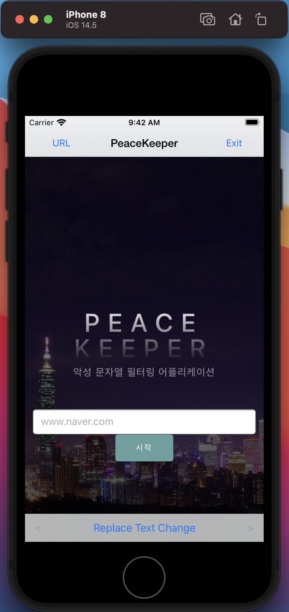
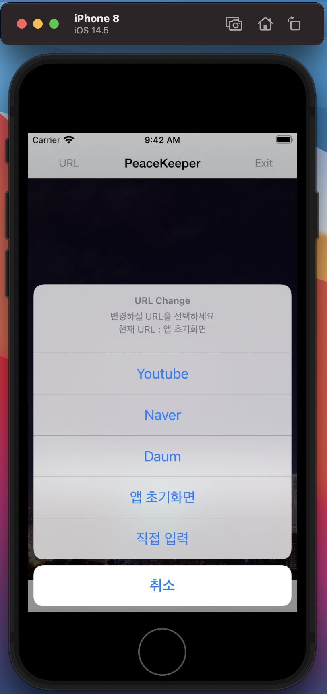
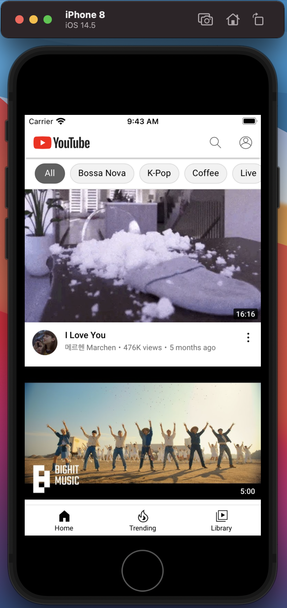
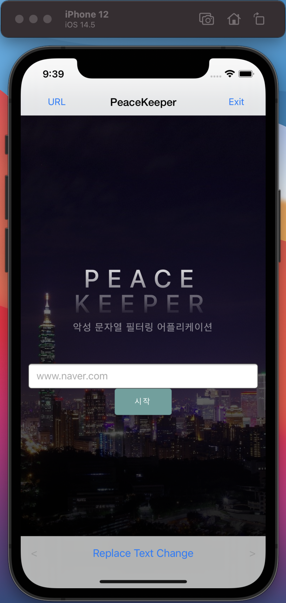
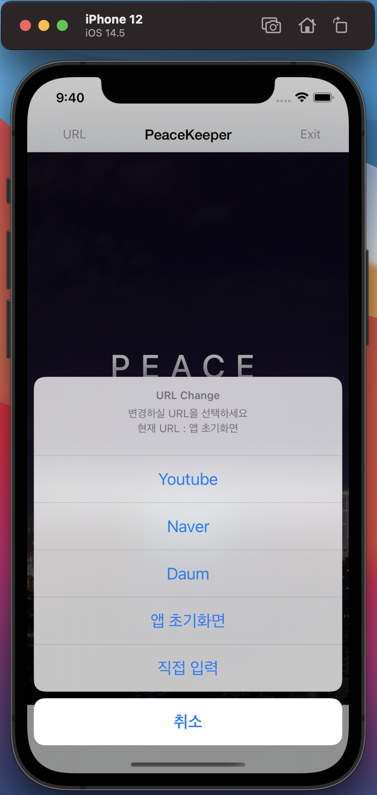
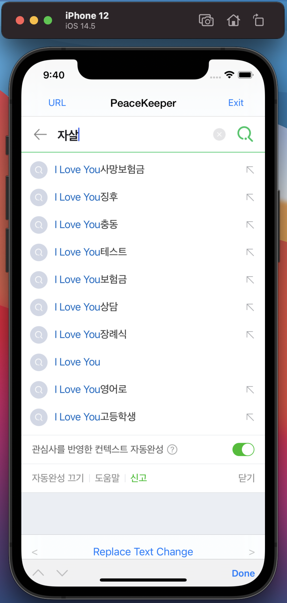
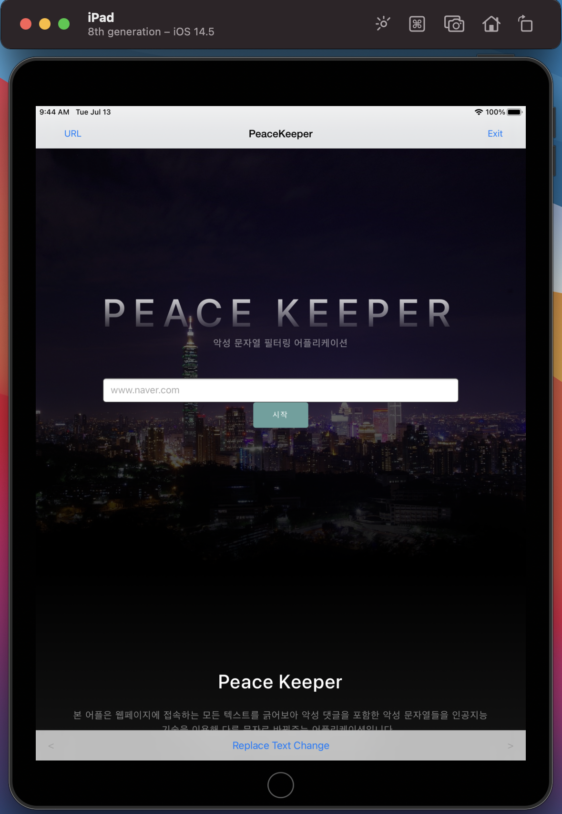
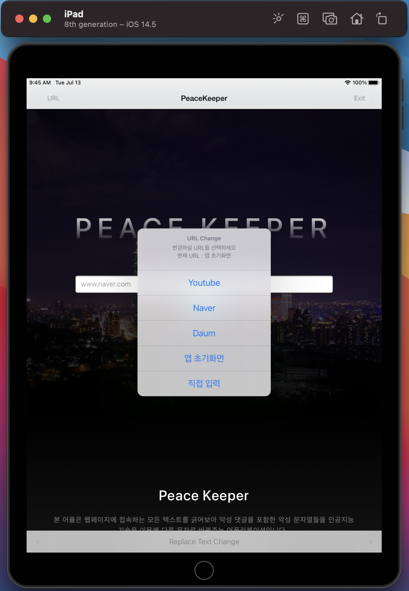
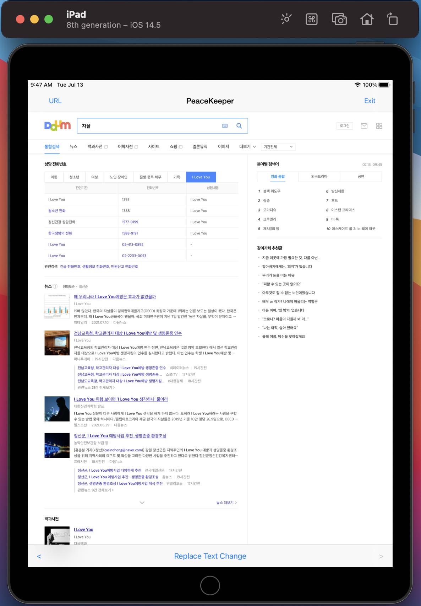
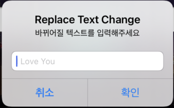

# PeaceKeeper_IOS

## 개요
본 레포지토리는 졸업프로젝트로 사용 될 PeaceKeeper 라는 프로그램의 ios 버전입니다.  
Apple Developer Program에 등록 후 Appstore에 등록하려 했지만 금전적 이유로 등록하지 않았습니다.  
따라서 해당 소스코드는 github에만 등록하기로 하였고, 이에 본 레포지토리를 상업적 용도로 이용할 것을 엄격히 금지하는 바입니다.  

***

## app 소개
> PeaceKeeper : 인공지능 기술을적용한 악성 문자열 필터링 어플리케이션

> 본 어플은 웹페이지에 접속하는 모든 텍스트를 긁어보아 악성 댓글을 포함한 악성 문자열들을 인공지능 기술을 이용해 다른 문자로 바꿔주는 어플리케이션입니다.  
> 악성 문자열로 판단되는 문자열은 모두 "I LOVE YOU"로 필터링됩니다.  
> 이제 사람들은 당신에게 선플을 다는 사람들이 될 것입니다. **(이용시 변경 가능합니다.)**  
> 악성 문자열을 글로 작성하는 것도 인터넷 자유의 권리입니다.  
> 그런 권리를 침해하지 않는 선에서 사용자가 악성 문자로 인해 멘탈이 흔들려지지 않도록 도와줍니다.  
> 기존에 나와있는 악성 문자열을 필터링해주는 기술들은 댓글 입력 부분에만 존재할 뿐더러, 아무리 인공지능을 사용해도 특정 사이트를 제외한 나머지 사이트는 적용되지 않았습니다.  
> 본 어플리케이션은 모든 사이트에 인공지능을 적용시켜주는 아주 고마운 어플리케이션입니다. :)  
> 이 어플리케이션을 통해 한사람 이상의 멘탈이 흔들리지 않았으면 좋겠고, 악성 문자열로 인해 생명을 잃는 일이 없었으면 좋겠습니다.  
> 이제 여러분도 악성 문자열에 흔들리지 마세요!  
>>  악성 문자열 : 악성 댓글을 포함한 기타 악의적으로 보이는 제목, 내용, 실시간 댓글 등 모든 것을 통칭하는 단어.

***

## IOS 버전
* Android 버전과 UX부분에서 상이한 점이 있을 수 있습니다. (URL_Change 버튼, statusBar)
* 이외에는 Android 버전과 매우 유사하게 만들었습니다.
* toolBar에 Back Button과 Front Button을 만들었으나 Reload Button은 만들지 않았습니다.
* URL_change 버튼에서 현재 URL을 보여주는데 앱 초기화면의 URL은 띄워지지 않게 만들었습니다.

***

## 실행 이미지
### IPhone 8
  
<앱 초기화면>  
  
<URL_Change>  
  
<악성 문자열이 치환된 모습>  

### IPhone 12
  
<앱 초기화면>  
  
<URL_Change>  
  
<악성 문자열이 치환된 모습>  

### IPad
  
<앱 초기화면>  
  
<URL_Change>  
  
<악성 문자열이 치환된 모습>  
  
<자신이 원하는 문자열로 바꾸고자 할 때 입력하는 창>  
